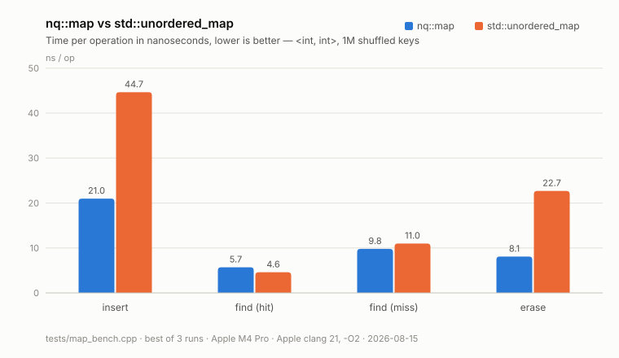

<p align="center">
  
  
  
  
  
</p>

Project of NowQuant.

A set of data structures and wire records for trading system. Header-only,
C++23, namespace `nlib`, no dependencies beyond the standard library.

Authors:
- Zhouzhou (https://zhouzhouzhang.co.uk)

## Components

| Header | Type | What it is |
|---|---|---|
| [`nlib/hive.h`](include/nlib/hive.h) | `nlib::hive<T>` | Minimal C++26 `std::hive` (P0447). Unordered element pool with O(1) insert and erase and **stable element addresses**; erased slots are tracked as jump-counting skipfield runs, so iteration skips a whole run in O(1). |
| [`nlib/map.h`](include/nlib/map.h) | `nlib::map<Key, T, Hash, KeyEqual>` | Flat open-addressing hash map: one allocation holding the slot array plus a control byte per slot (empty, tombstone, or a 7-bit hash fragment that pre-filters comparisons). Power-of-two capacity, linear probing, rehash at 3/4 load. |
| [`nlib/single_queue.h`](include/nlib/single_queue.h) | `nlib::single_queue<T>` | Bounded lock-free SPSC ring buffer. Capacity rounds up to a power of two at construction; each side owns a cache line holding its counter plus a cached copy of the other side's, so the hot path touches no shared line. |
| [`nlib/pool.h`](include/nlib/pool.h) | `nlib::pool<T>` | Growable object pool. `emplace()` returns an index handle, `release()` recycles the slot. Handles stay valid until released; growth may move elements, so it invalidates references, never handles. |
| [`nlib/memory_pool.h`](include/nlib/memory_pool.h) | `nlib::memory_pool` | Fixed-capacity fixed-size-block allocator over one contiguous aligned buffer. The LIFO free list is threaded through the freed blocks themselves, so there is no per-block metadata. |
| [`nlib/common.h`](include/nlib/common.h) | `nlib::order`, `nlib::trade`, `nlib::book`, `nlib::metrics` | The wire records every component on the feed path agrees on, plus the `side` / `order_type` / `order_action` enums and the `price_scale`, `qty_scale`, and `book_depth` constants. Not containers — see below. |

### Wire records

`common.h` is the shared vocabulary of the trading stack: an `order` or `trade`
as it arrives from a feed, a `book` holding the top `book_depth` (10) price
levels per side, and a `metrics` sample of a book pipeline's health. Consumers
such as [nqbook](https://github.com/Zhou-London/nqbook) include it rather than
declaring their own copies.

- **Trivially copyable and standard layout**, asserted at compile time — a
  record can be memcpy'd, mapped into shared memory, or written to a file as is.
  `static_assert`s also pin the wire sizes (`order` 88, `trade` 64, `book` 344,
  `metrics` 120), so layout drift fails the build instead of the peer.
- **Fixed point throughout.** Prices are in units of `1/price_scale` (1e-10) of
  the quote unit, quantities in `1/qty_scale` (1e-8) trading units — 10 price
  and 8 lot decimals, enough for every Kraken spot pair. No floating point on
  the feed path.
- **Two timestamps, both Unix-epoch nanoseconds**: `event_ns` is the exchange
  event time, `recv_ns` is stamped by the receiving process, so feed latency is
  measurable end to end. `book` carries both times of its latest applied event.
- **`order_action` is what the record does to the book**, and it selects the
  quantity field that carries the event: `add` rests `qty`, `cancel` takes
  `cancel_qty` out (the order leaves once nothing remains), `modify` sets the
  remaining quantity to `new_qty` while keeping queue priority at an unchanged
  price, and `clear` drops the instrument's resting orders ahead of a snapshot
  replay. One field per action means a consumer never has to read `qty`
  against the action to know what it means.
- `order` carries `prev` / `next` intrusive list hooks, written by whichever
  book owns the order, so resting an order costs no separate node allocation.
- **`metrics` is monitoring, not feed data**: cumulative feed/book/writer
  counters plus timed-apply accumulators and instantaneous book gauges,
  published unframed on its own socket. Difference consecutive samples for
  rates.

Shared conventions across the containers:

- **Move-only entry.** Elements enter by move or in-place construction; the
  containers themselves are not copyable. Nothing copies an element silently.
- **Thread-compatible** unless stated otherwise: concurrent `const` access is
  safe, writes need external synchronization. `single_queue` is the exception —
  it is the one type with a concurrent contract (one producer, one consumer).
- Iteration order is unspecified for `hive` and `map`.

## Using it

Header-only, exported as the `nlib::nlib` INTERFACE target:

```cmake
add_subdirectory(nlib)
target_link_libraries(my_app PRIVATE nlib::nlib)
```

```cpp
#include <nlib/map.h>

nlib::map<int, int> m;
m.try_emplace(42, 7);
if (auto it = m.find(42); it != m.end()) use(it->second);
```

## Building the tests

Tests are built when nlib is the top-level project (`NLIB_BUILD_TESTS`, default
`ON` there, `OFF` when consumed via `add_subdirectory`). GoogleTest v1.17.0 is
fetched by CMake, so the first configure needs network access.

```bash
cmake -S . -B build -DCMAKE_BUILD_TYPE=Release
cmake --build build -j
ctest --test-dir build --output-on-failure
```

## Benchmark

`tests/map_bench.cpp` is a benchmark, not a test — it is built but not
registered with CTest, and it is only meaningful from an optimized build:

```bash
./build/tests/map_bench   # prints CSV: container,workload,ns/op
```

1,000,000 shuffled keys, best of three runs, setup and teardown untimed:



`nlib::map` wins on insert and erase, where the flat layout avoids a node
allocation per element; lookups are comparable, since a hit costs a probe and a
key comparison either way.

## Releases

### v0.3.0 — 2026-08-22

`order` carries the quantity an action means in its own field. `order` grows
from 72 to 88 bytes, so every consumer must be rebuilt together.

- **`cancel_qty` and `new_qty`.** A `cancel` puts the quantity leaving the
  book in `cancel_qty`, a `modify` puts the new remaining quantity in
  `new_qty` (`<= 0` removes the order); both are 0 for the actions that do not
  use them. `qty` keeps one meaning — the resting quantity on an `add` — so a
  consumer no longer reads one field against `action` to learn what it holds.
- **`cancel` is no longer all-or-nothing.** It shrinks the resting order by
  `cancel_qty` and the order leaves only when nothing remains, which is what a
  feed reporting one quantity per event actually sends. A full cancel is the
  case where `cancel_qty` is the whole remainder.
- Both fields are inserted before `event_ns`, not appended, so every offset
  from `event_ns` on has moved. The `sizeof` asserts catch a stale consumer at
  compile time.

### v0.2.0 — 2026-08-17

`common.h` grew into the vocabulary a live exchange feed needs. Every record
changed layout, so consumers must be rebuilt together.

- **Event and receive time are separate.** `order` and `trade` carry
  `event_ns` (exchange event time) and a trailing `recv_ns` stamped on
  receipt; `book`'s `time_ns` is renamed `event_ns` and gains `recv_ns`. Feed
  latency is now measurable end to end. `recv_ns` is appended last, so every
  earlier offset is unchanged.
- **Quantities are fixed point** in `1/qty_scale` (1e-8) units — crypto
  quantities are fractional — and `price_scale` grows to 1e10. The pair covers
  Kraken's maximum 10 price and 8 lot decimals.
- **`order_action` gains `modify` and `clear`.** `modify` sets a new remaining
  quantity and keeps queue priority while the price is unchanged; `clear`
  drops an instrument's resting orders ahead of a snapshot replay. `cancel`
  now means the order leaves the book outright — a partial cancel arrives as
  `modify`.
- **`nlib::metrics`**, a 120-byte sample of a book pipeline's health:
  cumulative feed, book, and writer counters, the timed-apply latency
  accumulators, and instantaneous book gauges. Published unframed on a
  monitoring socket; `nqbook`'s metrics thread is the producer.
- **Wire sizes are asserted** (`order` 72, `trade` 64, `book` 344, `metrics`
  120), so a layout change fails the build rather than the peer.
- **`map::capacity()`** exposes the allocated slot count, letting a consumer
  account the table's memory — one `value_type` plus one control byte per slot
  — without reaching into the layout.

### v0.1.1 — 2026-08-17

- **`order::side` and `trade::side` are declared `nlib::side`.** Unqualified,
  the member hides the enum for the rest of the class scope, which GCC 13
  rejects under C++23 as `-Wchanges-meaning` and which broke every consumer
  compiling the header. Layout and the public spelling `o.side` are unchanged.

### v0.1.0 — 2026-08-15

The first published version: five containers and the shared wire records.

- **Containers** — `hive` (stable addresses, skipfield iteration), `map` (flat
  open-addressing), `single_queue` (lock-free SPSC ring), `pool` (handle-based
  object pool), `memory_pool` (fixed-size-block allocator). Each has a
  GoogleTest binary; `map` also has a benchmark against `std::unordered_map`.
- **`common.h`** — `order`, `trade`, and ten-level `book` records with the
  `side` / `order_type` / `order_action` enums, fixed-point prices, and
  nanosecond timestamps. `order` carries intrusive `prev` / `next` hooks so a
  book can rest it without a node allocation.
- **Namespace `nq` renamed to `nlib`**, matching the library and target names.
  Consumers must update qualified names; there is no compatibility alias.
- Insertion is move-only across every container: the `insert(const T&)`
  overloads are gone, so no insertion path copies an element silently.
- `vector` was removed — `std::vector` covers it, and a weaker duplicate of a
  standard container is not worth maintaining.

## Contribution
Fork and make a PR if you would like to give some improvements.

## License
Apache 2.0
